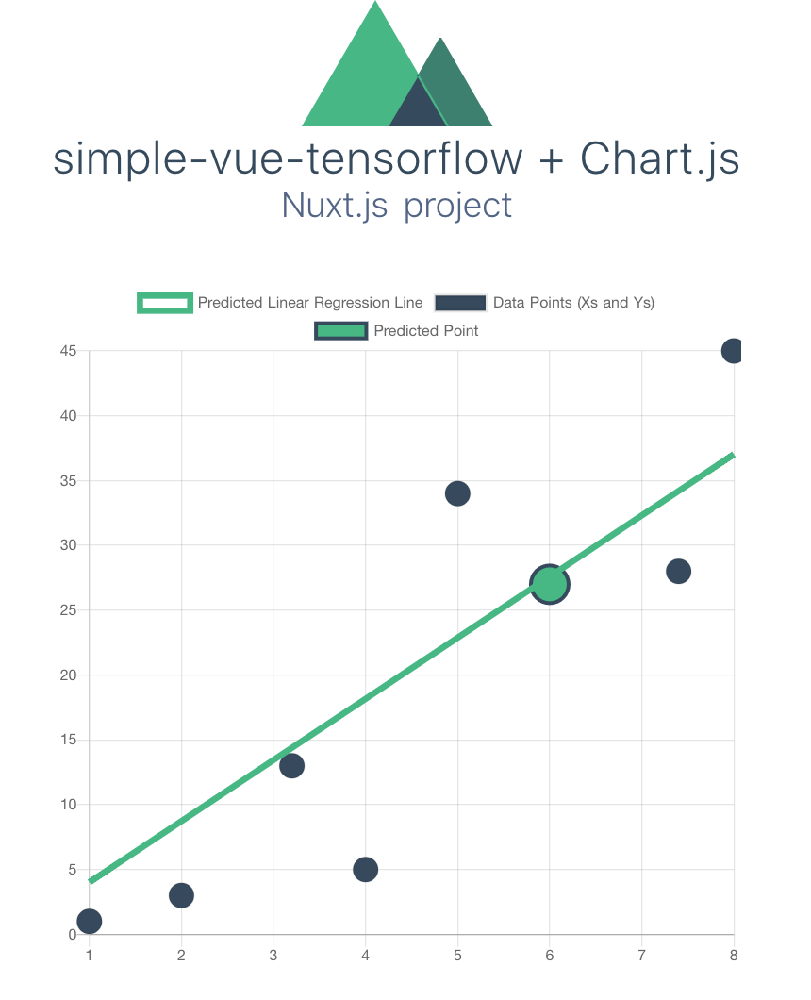

# simple-vue-tensorflow + Chart.js

Vue.js template with a simple Neural Network built using [tensorflow.js](https://www.tensorflow.org/js). 
The network is trained on X coordinates entered via input fields and 
tries to predict the corresponding Y coordinates. This process is called [linear regression](https://en.wikipedia.org/wiki/Linear_regression).
The data and predicted regression line are visualized using [vue-chartjs](https://vue-chartjs.org/). 



---

Built using vue init drginm/tensorflow-js-vuejs-starter-template simple-vue-tensorflow

> Nuxt.js project

## Build Setup

``` bash
# install dependencies
$ npm install # Or yarn install

# serve with hot reload at localhost:3000
$ npm run dev

# build for production and launch server
$ npm run build
$ npm start

# generate static project
$ npm run generate

# generate static project inside a subfolder
$ npm run generate:use-subfolder
```

For detailed explanation on how things work, checkout the [Nuxt.js docs](https://github.com/nuxt/nuxt.js).


https://github.com/vuejs-templates/webpack
https://github.com/nuxt-community/starter-template
https://nuxtjs.org/guide/installation
https://vuejs.org/v2/guide/installation.html


# For serving the generated files
npm install -g serve
serve ./dist
